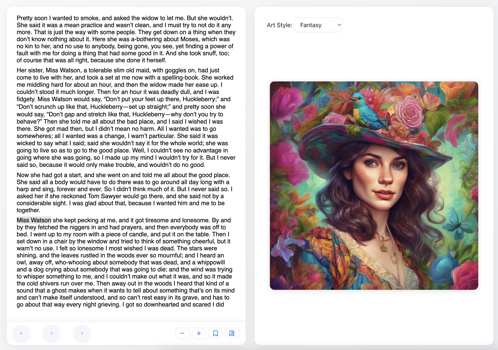

# EPUB AI Reader

[Live Demo](https://epub-ai-reader-multi.vercel.app/)
[DeepWiki](https://deepwiki.com/alekcangp/epub-ai-reader)

A modern web application for reading EPUB books, generating AI illustrations, and minting Zora coins (ERC-20) with seamless blockchain and IPFS integration.

## Features
- **EPUB Reader**: Upload and read EPUB books with bookmarks, navigation, and font controls.
- **AI Image Generation**: Summarize the current page or selected text and generate illustrations using Cloudflare Workers AI.
- **Art Style Selection**: Choose from multiple AI art styles (Cyberpunk, Fantasy, Futuristic, Abstract, Retro Wave, Sci-Fi) — your choice is persistent and always used for new images.
- **Zora Coin Minting**: Automate the creation and minting of a Zora erc-20 token for your book's text and illustrations on Base Mainnet or Base Sepolia.

## AI Models Used

- **Image Generation:** [Stable Diffusion XL](https://developers.cloudflare.com/workers-ai/models/image-generation/stable-diffusion-xl/) (via Cloudflare Workers AI)
- **Text Summarization:**
  - **Primary:** [AI Summary Agent](https://ai.io.net/ai/agents) (multilanguages)
  - **Fallback:** [Facebook BART](https://developers.cloudflare.com/workers-ai/models/bart-large-cnn/) (via Cloudflare Workers AI)

> The app uses the AI agent API for text summarization by default. If that service is unavailable (limit), it automatically falls back to Cloudflare Workers AI (BART model). Image generation always uses Cloudflare Workers AI (Stable Diffusion XL). You can swap models or endpoints in the code as needed.

## Screenshot

## Deployment

- Click the button below to deploy your own instance to Vercel with one click:

  

- Ensure all environment variables are set in the Vercel dashboard (case-sensitive). See `.env.example` for required variables.

## License

MIT

## Supported Networks for Minting

You can mint on either **Base Mainnet** or **Base Sepolia**. The app will automatically use the network you are connected to in MetaMask. If you are not on one of these networks, you will be prompted to switch before minting.
